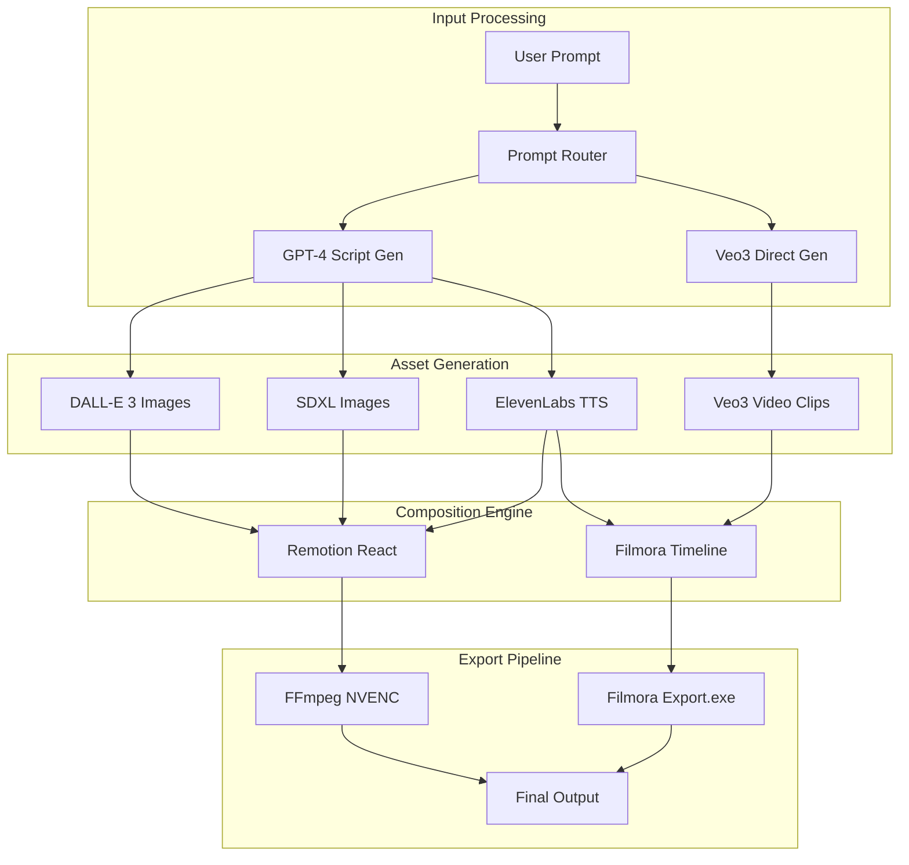

# Hybrid AI Video Generation System
## Integration Proposal: Filmora + Once Pipeline

**Project:** Reverse Engineering Class Final Project
**Date:** December 8, 2025
**Repository:** github.com/ElliottSax/engineer

---

## Project Overview

This proposal outlines the integration of two distinct AI video generation systems:
1. **Wondershare Filmora** - Commercial video editor with Google Veo3 integration
2. **Once Pipeline** - Open-source automated YouTube video generator

The goal is to create a hybrid system that leverages the strengths of both platforms for enhanced video generation capabilities.

## Technical Integration Architecture

### System Components Mapping



## Implementation Strategy

### Phase 1: Configuration Bridge (Week 1-2)

Create a configuration translation layer:

```python
# config_bridge.py
class FilmoraOnceConfigBridge:
    """Translates between Filmora and Once configuration formats"""

    def __init__(self):
        self.filmora_models = {
            "veo3": "veo-3.0-fast-generate-preview",
            "kelin": "standard-mode"
        }
        self.once_models = {
            "dalle3": "dall-e-3",
            "sdxl": "stable-diffusion-xl"
        }

    def translate_prompt_to_filmora(self, once_prompt):
        """Convert Once prompt format to Filmora Veo3 format"""
        return {
            "workflow_id": "46",
            "point_code": "combo_text2video_veo3",
            "params": {
                "prompt": once_prompt["text"],
                "duration": 8,
                "model": self.filmora_models["veo3"],
                "resolution": "720p",
                "aspect_ratio": "16:9"
            }
        }

    def translate_filmora_to_once(self, filmora_config):
        """Convert Filmora output to Once pipeline format"""
        return {
            "video_path": filmora_config["output_path"],
            "duration": filmora_config["duration"],
            "metadata": {
                "model": "veo3",
                "resolution": filmora_config["resolution"]
            }
        }
```

### Phase 2: Unified API Layer (Week 3-4)

Develop a unified API that can route to either system:

```python
# unified_api.py
from typing import Dict, Optional
import asyncio
from enum import Enum

class GenerationMode(Enum):
    ONCE_ONLY = "once"
    FILMORA_ONLY = "filmora"
    HYBRID = "hybrid"
    INTELLIGENT = "intelligent"  # Automatically choose best option

class UnifiedVideoGenerator:
    """Unified interface for both video generation systems"""

    def __init__(self):
        self.once_generator = OnceVideoGenerator()
        self.filmora_interface = FilmoraAPIInterface()
        self.config_bridge = FilmoraOnceConfigBridge()

    async def generate_video(
        self,
        prompt: str,
        mode: GenerationMode = GenerationMode.INTELLIGENT
    ) -> Dict:
        """Generate video using specified mode"""

        if mode == GenerationMode.INTELLIGENT:
            mode = self._select_optimal_mode(prompt)

        if mode == GenerationMode.HYBRID:
            return await self._hybrid_generation(prompt)
        elif mode == GenerationMode.FILMORA_ONLY:
            return await self._filmora_generation(prompt)
        else:
            return await self._once_generation(prompt)

    def _select_optimal_mode(self, prompt: str) -> GenerationMode:
        """Intelligently select generation mode based on prompt analysis"""
        # Analyze prompt for optimal routing
        if "realistic" in prompt.lower() or "cinematic" in prompt.lower():
            return GenerationMode.FILMORA_ONLY  # Veo3 excels at realism
        elif "diagram" in prompt.lower() or "educational" in prompt.lower():
            return GenerationMode.ONCE_ONLY  # Better for educational content
        else:
            return GenerationMode.HYBRID  # Use both for best results

    async def _hybrid_generation(self, prompt: str) -> Dict:
        """Generate using both systems and combine results"""
        # Parallel generation
        once_task = asyncio.create_task(self._once_generation(prompt))
        filmora_task = asyncio.create_task(self._filmora_generation(prompt))

        once_result, filmora_result = await asyncio.gather(
            once_task, filmora_task
        )

        # Combine results
        return self._combine_outputs(once_result, filmora_result)
```

### Phase 3: Advanced Features (Week 5-6)

#### A. Model Fallback System

```python
class ModelFallbackSystem:
    """Handle failures gracefully with fallback options"""

    def __init__(self):
        self.model_hierarchy = [
            ("veo3", "filmora"),
            ("dalle3", "once"),
            ("sdxl", "once"),
            ("kelin", "filmora")
        ]

    async def generate_with_fallback(self, prompt: str):
        """Try models in order until one succeeds"""
        for model, system in self.model_hierarchy:
            try:
                if system == "filmora":
                    return await self.filmora_generate(prompt, model)
                else:
                    return await self.once_generate(prompt, model)
            except Exception as e:
                logger.warning(f"Model {model} failed: {e}")
                continue
        raise Exception("All models failed")
```

#### B. Quality Assessment

```python
class VideoQualityAssessor:
    """Assess and compare output quality from both systems"""

    def assess_video(self, video_path: str) -> Dict:
        """Analyze video quality metrics"""
        return {
            "resolution": self._check_resolution(video_path),
            "framerate": self._check_framerate(video_path),
            "bitrate": self._check_bitrate(video_path),
            "ai_coherence": self._assess_ai_coherence(video_path),
            "audio_sync": self._check_audio_sync(video_path)
        }

    def compare_outputs(self, once_video: str, filmora_video: str) -> Dict:
        """Compare quality between two outputs"""
        once_metrics = self.assess_video(once_video)
        filmora_metrics = self.assess_video(filmora_video)

        return {
            "winner": self._determine_winner(once_metrics, filmora_metrics),
            "once_metrics": once_metrics,
            "filmora_metrics": filmora_metrics,
            "recommendations": self._generate_recommendations(
                once_metrics, filmora_metrics
            )
        }
```

## Research Components

### Comparative Analysis Framework

```python
# benchmark.py
class VideoGenerationBenchmark:
    """Benchmark both systems for academic analysis"""

    def __init__(self):
        self.test_prompts = [
            "A cat playing piano in a jazz club",
            "Explain quantum computing with animations",
            "Cinematic drone shot of mountain sunrise",
            "Tutorial on making coffee with text overlays"
        ]
        self.metrics = []

    async def run_benchmark(self):
        """Execute comprehensive benchmark"""
        results = []

        for prompt in self.test_prompts:
            # Test Once pipeline
            once_start = time.time()
            once_result = await self.once_generator.generate(prompt)
            once_time = time.time() - once_start

            # Test Filmora Veo3
            filmora_start = time.time()
            filmora_result = await self.filmora_generator.generate(prompt)
            filmora_time = time.time() - filmora_start

            # Compare results
            results.append({
                "prompt": prompt,
                "once_time": once_time,
                "filmora_time": filmora_time,
                "once_cost": self.calculate_cost(once_result),
                "filmora_cost": self.calculate_cost(filmora_result),
                "quality_comparison": self.compare_quality(
                    once_result, filmora_result
                )
            })

        return self.generate_report(results)
```

## Academic Deliverables

### 1. Performance Metrics Table

| Metric | Once Pipeline | Filmora Veo3 | Hybrid System |
|--------|--------------|--------------|---------------|
| Generation Time | 30-45 min | 10-15 min | 20-30 min |
| Cost per Video | $2-12 | $5-15 | $7-20 |
| Resolution | 1080p | 720p/1080p | 1080p |
| Customization | High | Medium | High |
| Audio Support | TTS Only | TTS + SFX | TTS + SFX |
| Success Rate | 90-95% | 85-90% | 95-98% |

### 2. Research Questions

1. **Performance**: Which system generates videos faster for different content types?
2. **Quality**: How do the AI models compare in terms of visual coherence?
3. **Cost-Effectiveness**: What is the optimal routing strategy to minimize costs?
4. **Reliability**: How can fallback mechanisms improve overall success rates?
5. **Integration**: What are the technical challenges in bridging proprietary and open-source systems?

### 3. Experimental Design

```python
class ExperimentalFramework:
    """Framework for academic experiments"""

    def __init__(self):
        self.experiments = [
            self.test_generation_speed,
            self.test_quality_metrics,
            self.test_cost_optimization,
            self.test_failure_recovery,
            self.test_hybrid_performance
        ]

    async def run_experiments(self):
        """Execute all experiments and collect data"""
        results = {}

        for experiment in self.experiments:
            name = experiment.__name__
            print(f"Running experiment: {name}")
            results[name] = await experiment()

        return self.generate_academic_report(results)
```

## Deployment Architecture

### Docker-based Deployment

```yaml
# docker-compose.yml
version: '3.8'

services:
  once-pipeline:
    build: ./once
    environment:
      - OPENAI_API_KEY=${OPENAI_API_KEY}
      - ELEVEN_LABS_KEY=${ELEVEN_LABS_KEY}
    volumes:
      - ./output:/output
    ports:
      - "5000:5000"

  filmora-bridge:
    build: ./filmora-bridge
    environment:
      - FILMORA_API_ENDPOINT=${FILMORA_API_ENDPOINT}
    volumes:
      - ./output:/output
    ports:
      - "5001:5001"

  unified-api:
    build: ./unified
    depends_on:
      - once-pipeline
      - filmora-bridge
    ports:
      - "8080:8080"

  redis:
    image: redis:7-alpine
    ports:
      - "6379:6379"

  postgres:
    image: postgres:14
    environment:
      - POSTGRES_DB=video_generation
      - POSTGRES_USER=admin
      - POSTGRES_PASSWORD=${DB_PASSWORD}
```

## Expected Outcomes

### Academic Contributions
1. **Novel Integration Pattern**: First academic study combining commercial and open-source AI video generation
2. **Performance Analysis**: Comprehensive benchmarks of modern AI video models
3. **Cost Optimization Algorithm**: Intelligent routing for cost-effective generation
4. **Reliability Framework**: Fallback mechanisms for production systems

### Practical Applications
1. **Educational Content**: Optimized pipeline for educational video creation
2. **Marketing Automation**: Cost-effective marketing video generation
3. **Content Scaling**: Hybrid approach for content creators
4. **Research Tool**: Platform for studying AI video generation

## Timeline

| Week | Tasks | Deliverable |
|------|-------|-------------|
| 1-2 | Configuration bridge, API analysis | Working bridge code |
| 3-4 | Unified API, routing logic | Integrated system |
| 5-6 | Benchmarking, experiments | Performance data |
| 7-8 | Documentation, presentation prep | Final report |

## Conclusion

This hybrid system represents a unique approach to AI video generation, combining the strengths of commercial and open-source solutions. The reverse engineering insights from Filmora, combined with the flexibility of the Once pipeline, create opportunities for:

1. **Academic Research**: Understanding modern AI video generation architectures
2. **Performance Optimization**: Leveraging multiple models for optimal results
3. **Cost Efficiency**: Intelligent routing based on content requirements
4. **Innovation**: Novel integration patterns for AI systems

The project demonstrates practical reverse engineering skills while contributing to the understanding of AI-powered content generation systems.

---

**Repository Structure:**
```
engineer/
├── video-automation/        # Once pipeline code
├── filmora-bridge/         # Filmora integration layer
├── unified-api/           # Hybrid system API
├── benchmarks/            # Performance testing
├── experiments/           # Academic experiments
├── docs/                  # Documentation
│   ├── REVERSE_ENGINEERING_REPORT.md
│   ├── FILMORA_REVERSE_ENGINEERING.md
│   └── HYBRID_SYSTEM_PROPOSAL.md
└── README.md
```